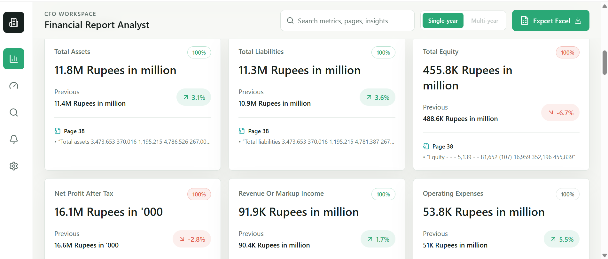

# AI Financial Agent

End-to-end setup that avoids common pitfalls (wrong folder for Python imports, frontend/backend port mismatches).

## Purpose of the Agent

This project turns annual-report PDFs into actionable financial intelligence for analysts and decision-makers.

- Extracts key financial metrics from uploaded statements with source grounding.
- Calculates ratios and trend signals to highlight performance changes.
- Generates AI-assisted insights with confidence cues and references.
- Supports multi-year comparison to review side-by-side trends.
- Exports analysis artifacts (dashboard data and Excel reports) for sharing.

## Dashboard Preview

Add your dashboard screenshot at `docs/images/dashboard.png` and it will render here on GitHub:



## Prerequisites

- Python 3.11+ (3.13 OK)
- Node.js 18+

## One-time setup

**Backend**

```powershell
cd backend
py -m venv .venv
.\.venv\Scripts\Activate.ps1
py -m pip install -r requirements.txt
Copy-Item .env.example .env
# Edit .env — set GEMINI_API_KEY (or GOOGLE_API_KEY)
```

**Frontend**

```powershell
cd frontend
npm install
```

## Run (every day)

Use **two terminals**. Always `cd` to the repo root first (`AI_Financial_Agent`).

**Terminal 1 — API** (script forces correct `backend` folder + `import app`):

```powershell
cd "c:\Users\KTS\Desktop\AI_Financial_Agent"
.\scripts\dev-backend.ps1
```

Or: `scripts\dev-backend.bat`

Confirm: [http://127.0.0.1:8000/health](http://127.0.0.1:8000/health) returns `{"status":"ok"}`.

**Terminal 2 — UI**

```powershell
cd "c:\Users\KTS\Desktop\AI_Financial_Agent\frontend"
npm run dev
```

Open the URL Vite prints (usually [http://localhost:5173](http://localhost:5173)).

### Why this is stable

- The backend script **`cd`s into `backend`** before `uvicorn`, so you never get `No module named 'app'`.
- The frontend uses **`/api` in development** and **Vite proxies** to `http://127.0.0.1:8000`. You can change API ports without breaking the UI unless you also set `VITE_API_PROXY_TARGET` (see `frontend/.env.example`).

### Overrides

- Point the UI at a remote API: set `VITE_API_BASE_URL` in `frontend/.env.local` (full URL ending in `/api`).
- FastAPI not on port 8000: set `VITE_API_PROXY_TARGET` when starting Vite (see `frontend/.env.example`).
- **`net::ERR_CONNECTION_RESET` during upload/process:** long Gemini/PDF runs need extended timeouts — defaults are **10 minutes** for both the Vite proxy (`VITE_API_PROXY_TIMEOUT_MS`) and the fetch abort timer (`VITE_PROCESSING_TIMEOUT_MS`). Restart **`npm run dev`** after changing them. Avoid **`uvicorn --reload`** saving files **mid-request** (reload drops active connections).
